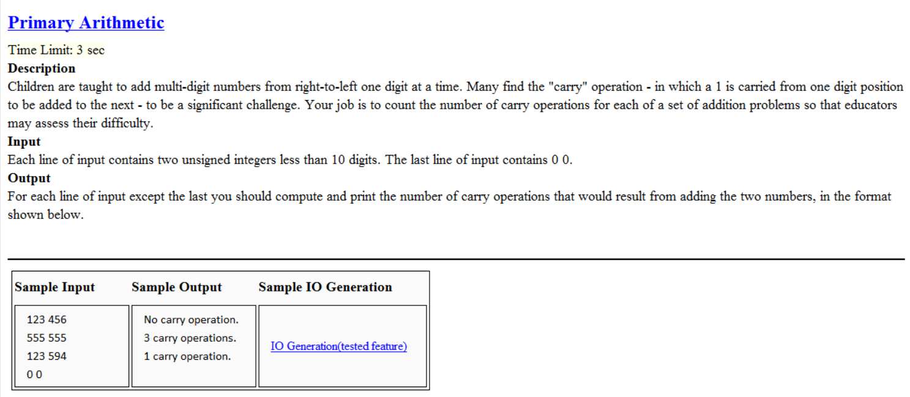

## 本題要計算兩個數字相加的總進為次數 因此我們要將各單位的數字分別運算並累加進為次數
```cpp
#include<iostream>
using namespace std;
int main()
{
	
	
	int a,b,count=0,p,ca=0;
	cin>>a>>b;
	while(a!=0&&b!=0)
	{
		for(int i=0;i<10;i++)
		{
		p=a%10+b%10+ca;
		if(p>=10)
		{
			a/=10;
			b/=10;
			count+=1;
			ca=1;
			p=0;
		}
		else if(p<=10)
		{
			a/=10;
			b/=10;
			ca=0;
			p=0;
		}
		}
		if(count==0)	cout<<"No carry operation."<<endl;//邏輯判斷要使用== 而非=
		else if(count==1) cout<<"1 carry operation."<<endl;
		else 		cout<<count<<" carry operations."<<endl;
		
		count=0;
		ca=0;
		cin>>a>>b;
		
	}
	
	return 0;
}
```
## 解題重點
+ 邏輯判斷式：或`||`、且`&&`、等於`==`
+ 當有要記數且重複使用的程式 在迴圈前要先將變數歸零