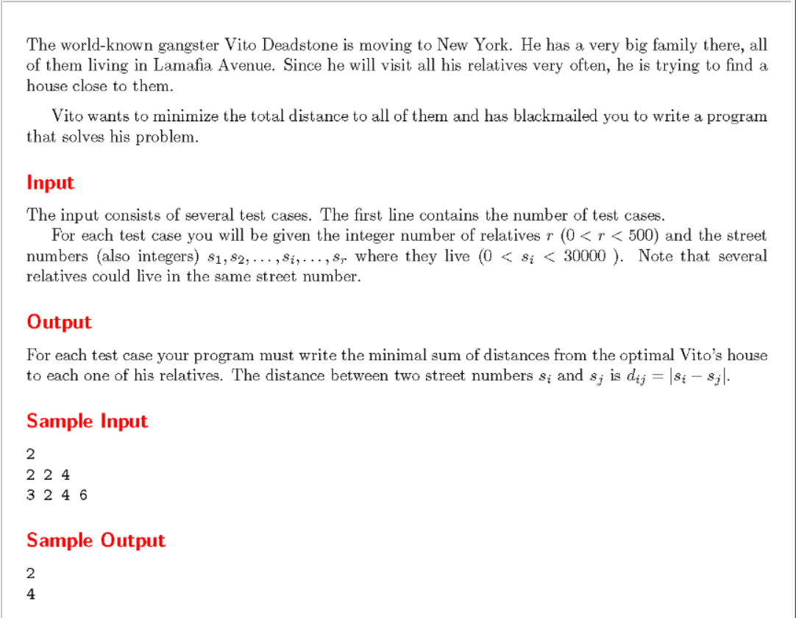

## 根據題意 我們需要使用讓vito住在所有親戚家的中間位置，使其到各親戚家的距離總和最小。


```cpp
#include<iostream>
#include<vector>
#include<algorithm>
using namespace std;
int main()
{
	int tc,rn,sites;//定義變數 tc：程式執行次數；rn：親戚的數量：sites：居住座標
	vector<int> list;//定義一個常數向量list
	cin>>tc;
	while(tc--)
	{
		cin>>rn;
		for(int i=0;i<rn;i++)
		{
			cin>>sites;
			list.push_back(sites);//將資料存入向量
		}
		sort(list.begin(),list.end());
		
		int mid=rn/2,sum=0;
		for(int j=0;j<rn;j++)
		{
			sum+=abs(list[j]-list[mid]);//使用絕對值計算中位數和各數值差之總和
		}
		cout<<sum<<endl;
		
		list.clear();
		
	}
	return 0;
	}
```
## 解題重點
+ 向量的基本指令
+ sort進行排序
+ abs 取絕對值