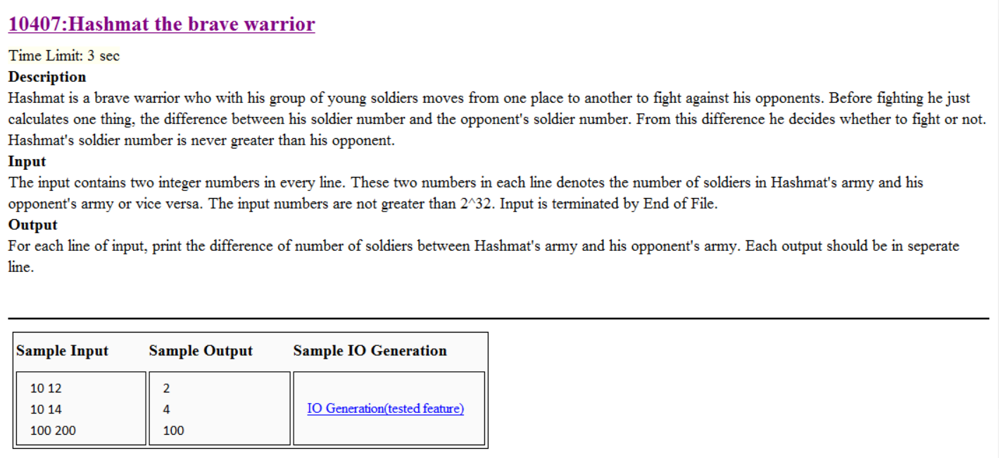

## 本題是要計算兩個部隊的人數差距


```cpp
#include<iostream>
using namespace std;
int main()
{
	long long a,b;
	while(cin>>a>>b)        //條件判斷是否EOF
		cout<<abs(a-b)<<endl;
	return 0;
}
```
## 解題重點
+ Input is terminated by End of File. 當沒有新的資料時結束程式
+ 在此使用while()條件句 來進行EOF判斷


