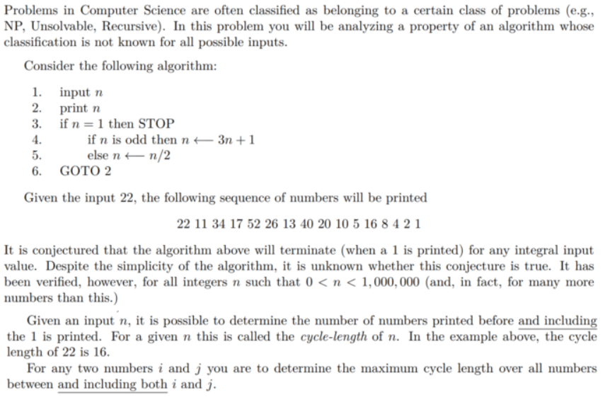
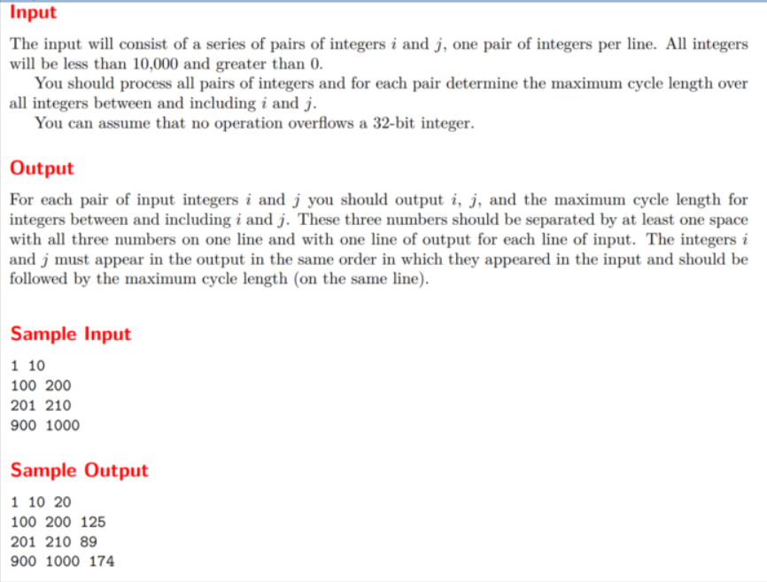

## 本題
```cpp
#include<iostream>
using namespace std;
int main()
{
	int a,b,n,c,max;
	while(cin>>a>>b)
	{	
		max=0;
		cout<<a<<" "<<b<<" ";
		if(a>b)	swap(a,b);      //避免數值大小順序錯誤
	
		for(int i=a;i<=b;i++)
		{
			n=i;
			c=1;
			while(n!=1)
			{
				if(n%2==1)	
				{
					n=3*n+1;
					c++;
				}
				else	
				{
					n/=2;
					c++;
				}
			}
			if(c>max)	max=c;
		
		}
		cout<<max<<endl;
	}
	return 0;
}
```

## 解題重點
+ 英文很重要
+ 紀錄數值每一輪記得歸零
+ if for while搞清楚@@
+ 注意輸出
